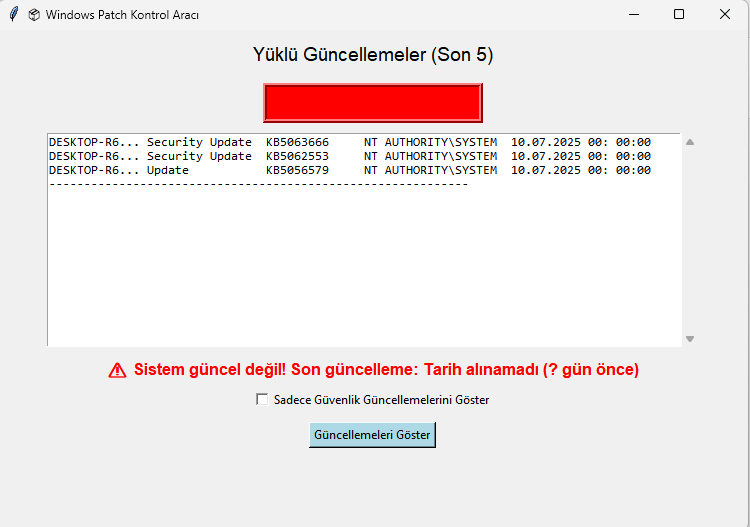

# 📦 Windows Patch Kontrol Aracı (Python GUI)

Bu proje, PowerShell ve Python kullanarak Windows işletim sisteminde yüklü güncellemeleri kontrol eden, arayüz üzerinden gösteren ve log tutan bir araçtır. Ayrıca sistemin güncel olup olmadığını analiz eder ve kullanıcıya uyarı verir.

## 🎯 Özellikler

- PowerShell üzerinden yüklü güncellemeleri listeler
- Son 5 güncellemeyi GUI'de gösterir
- "Sadece güvenlik güncellemeleri" filtresi ile içerik daraltılabilir
- Sistem güncel değilse kırmızı uyarı ve renkli durum kutusu gösterir
- Her kontrol işlemini CSV formatında `patch_log.csv` dosyasına kaydeder

## 💻 Kullanılan Teknolojiler

- Python (Tkinter, subprocess, csv)
- PowerShell (`Get-HotFix` komutu)
- GUI tasarımı: Tkinter

## 🚀 Proje Amacı

Kurumsal IT süreçlerinde kullanılan yama yönetimi sistemlerine benzer temel bir patch kontrol mantığını simüle etmek. Özellikle sistem yöneticiliği, uç nokta güvenliği ve SCCM gibi pozisyonlara yönelik teknik vitrin oluşturmak amacıyla geliştirilmiştir.

---
